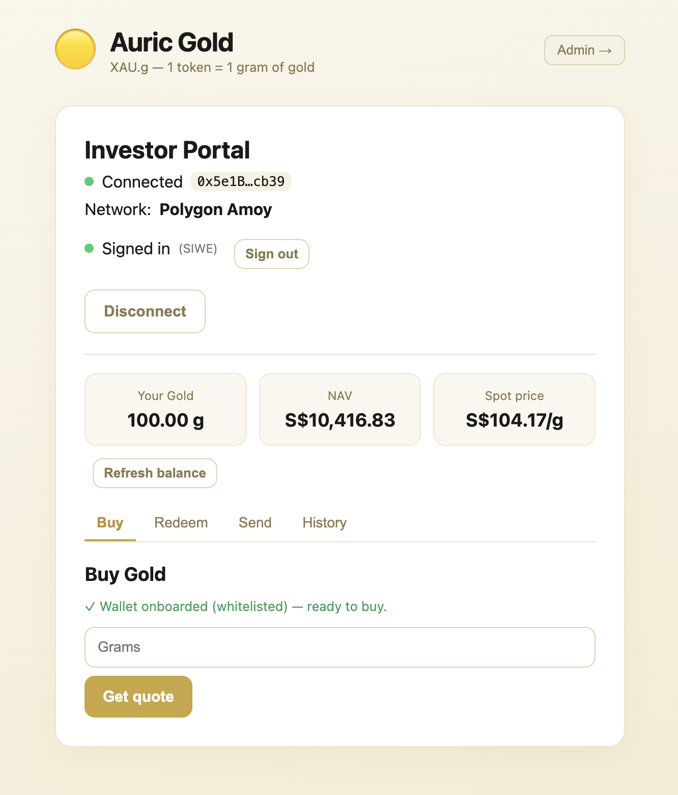

# Auric — Gold Tokenisation Platform (Pilot)

Auric issues **XAU.g**, an ERC-3643 *permissioned* token where **1 token = 1 gram of physical gold**, on Polygon. It is a full off-chain/on-chain system: the chain enforces who may hold the token; an off-chain Token Engine is the only minter and is responsible for the thing that actually matters — never letting tokens exist that aren't backed by gram-for-gram gold in a vault.



> **Pilot / POC scope:** the only real external system is the **Polygon Amoy testnet**. Every other vendor (vault, bullion dealer, KYC, price oracle, bank) is **simulated** behind swappable adapters, so the failure handling can be tested deterministically. No real money, gold, or PII.

- **ERC-3643-style permissioning** — every transfer checks an on-chain Identity Registry + Compliance module; a non-whitelisted wallet simply cannot receive the token.
- **Mint and burn are sagas, never DB transactions** — the chain `send()` happens *outside* any `@Transactional` boundary, with idempotency keys so a retried request can't double-mint.
- **Redemption is escrow-then-burn** — lock tokens → sell gold → confirm SGD settlement → *then* burn. A failure before settlement returns the escrow; tokens are never destroyed without a completed payout.
- **100% backing, continuously reconciled** — minting is gated on payment **plus** an atomic vault-headroom reservation; a background reconciler pauses minting the moment supply exceeds vault grams.
- **Live on Polygon Amoy** — all five contracts deployed and source-verified on PolygonScan; real mints and redemptions driven from the browser via MetaMask.

---

## Architecture

```
                 Browser  (React 18 + wagmi/viem)
          wallet picker · SIWE sign-in · buy / redeem / send / admin
                              │  REST + JSON
                              ▼
                 Token Engine  (Spring Boot 3.3 / Java 21)
        mint & redeem sagas · pricing · reconciliation · audit · alerts
        ┌──────────────┬───────────────────┬──────────────────┐
        ▼              ▼                   ▼                  ▼
     Web3j        Vendor adapters      PostgreSQL          Alert sink
        │          (mock │ real)       ledger + audit      console/webhook
        ▼              ▼
   Polygon Amoy   Vendor simulator  (Node/Express)
   ERC-3643 suite  vault · dealer · KYC · bank · FX  +  chaos-injection API
```

Off-chain **orchestrates**; on-chain **enforces**. The PostgreSQL ledger and audit log mirror on-chain events. Every vendor sits behind a port (`VaultProvider`, `DealerProvider`, `KycProvider`, `OracleProvider`, `BankProvider`); switching from the simulator to a real vendor is a config flip (`mock → real`), not a code change.

---

## Requirements

**hardware:** 8 GB RAM, ~3 GB disk. Linux, macOS, or Windows (WSL2). x86_64 or arm64. Backend uses ~1 GB heap; Postgres ~200 MB; the Hardhat node and Vite dev server are light.

**software:**

| | Version | Notes |
|---|---|---|
| Java | 21 LTS | Temurin/Corretto/Zulu all fine. Use the bundled `./mvnw` — no system Maven needed. |
| Node | 18+ | For the web portal, the Hardhat smart-contract project, and the vendor simulator. |
| npm | latest | Ships with Node. |
| Docker | Desktop or Colima | PostgreSQL 15 is spun up via `docker compose`. |
| MetaMask | latest | Browser wallet — connect, switch to Amoy, sign in (SIWE), user-signed transfers. |
| Amoy RPC + key | env var | A Polygon Amoy RPC URL (e.g. Alchemy) for the engine, plus a funded test minter key. The public `https://rpc-amoy.polygon.technology` works as a fallback. |

Developed and tested primarily on macOS (Apple Silicon). One host quirk to know: **Postgres runs on host port `5433`** (5432 is assumed taken), baked into the compose file and scripts.

---

## Quick Start

```bash
# 1. Full local backend: Postgres + vendor simulator + Hardhat node (deployed) + Token Engine
./run-local.sh

# 2. Web portal
cd auric-web && npm run dev          # → http://localhost:5173

# stop everything
./stop-local.sh
```

From the browser: **connect a wallet** (pick MetaMask) → **switch to the local/Amoy network** → **🔐 Sign in** (SIWE — a free signature) → **Onboard** the wallet (whitelist) → **Buy** grams → see the mint land in your wallet. Then try **Redeem** (escrow-then-burn) and **Send** (a user-signed P2P transfer).

To point the portal at the live testnet instead of local, `auric-web/.env` ships configured for **Polygon Amoy** (chainId 80002, the deployed token address); set `VITE_CHAIN_ID=31337` to go back to local.

---

## Installation

Auric has three parts that run together. The fastest path is **`./run-local.sh`** (see [Quick Start](#quick-start)) — it builds and starts everything for you. The guides below install each part **by hand**, which is useful if you're working on just one piece or running the backend from an IDE.

**Recommended order: smart contracts → backend → frontend.** (The backend needs the deployed contract addresses; the frontend needs the backend's API.)

### 1. Smart contracts — `auric-smart-contract`

The ERC-3643 token suite. **Needs:** Node 18+.

```bash
cd auric-smart-contract
npm install
cp .env.example .env              # only needed for an Amoy deploy (deployer key + RPC)

npx hardhat compile
npm test                          # expect: 44 passing
```

Deploy to a **local** chain (two terminals):

```bash
npx hardhat node                  # terminal A — local chain on :8545 (leave running)
npm run deploy:local              # terminal B — deploys + writes deployments/localhost.json
npm run export                    # export ABIs + addresses to exports/ for the backend & web
```

Deploy to **Polygon Amoy** (needs a funded deployer key in `.env`):

```bash
npm run deploy:amoy               # writes deployments/amoy.json
npm run verify:amoy               # source-verify on PolygonScan
```

> Deploying to Amoy mints you your **own** set of contract addresses. See [Deploy to Polygon Amoy](#deploy-to-polygon-amoy) for the full walkthrough (wallets, faucet, deploy, verify, and wiring the addresses into the apps).

### 2. Token Engine backend — `auric-api`

The Spring Boot backend. **Needs:** Java 21, Docker (for Postgres), Node (for the vendor simulator), and a chain to talk to (the local Hardhat node from step 1, or Amoy).

```bash
# 1 — Postgres 15 on host port 5433
docker compose up -d postgres

# 2 — vendor simulator on :9090 (separate terminal)
cd auric-api/vendor-simulator
npm install
npm start

# 3 — build & run the engine (from auric-api/)
cd auric-api
./mvnw clean package                                       # builds + runs tests
DB_PORT=5433 SPRING_PROFILES_ACTIVE=local,mock ./mvnw spring-boot:run
```

Check it's up: `curl localhost:8080/actuator/health` → `{"status":"UP"}`.

**From an IDE (IntelliJ):** run `./run-deps.sh` to start the dependencies, then run `TokenEngineApplication` ▶ — profiles default to `local,mock` and the DB to `5433`, so no env vars are needed.

**Against Amoy** instead of local: use the `amoy,mock` profile and supply your RPC + minter key (see `auric-api/src/main/resources/application-amoy.yml`):

```bash
DB_PORT=5433 SPRING_PROFILES_ACTIVE=amoy,mock \
MINTER_PRIVATE_KEY=0x... BLOCKCHAIN_RPC_URL=https://... \
java -jar target/token-engine-0.1.0-SNAPSHOT.jar
```

> Secrets live only in a git-ignored `.env` — copy `.env.example` and fill in **test** keys. Never commit real keys.

### 3. Web portal — `auric-web`

The React investor + admin portal. **Needs:** Node 18+, MetaMask in your browser, and the backend (step 2) running.

```bash
cd auric-web
npm install
cp .env.example .env              # then set the chain + addresses (table below)
npm run dev                       # → http://localhost:5173
```

Key settings in `auric-web/.env`:

| Variable | Local (Hardhat) | Polygon Amoy |
|---|---|---|
| `VITE_CHAIN_ID` | `31337` | `80002` |
| `VITE_GOLD_TOKEN_ADDRESS` | *(local default)* | *(your GoldToken, from `deployments/amoy.json`)* |
| `VITE_IDENTITY_REGISTRY_ADDRESS` | *(local default)* | *(your IdentityRegistry, from `deployments/amoy.json`)* |
| `VITE_API_BASE_URL` | `http://localhost:8080` | `http://localhost:8080` |

For the Amoy addresses, deploy first — see [Deploy to Polygon Amoy](#deploy-to-polygon-amoy). In MetaMask, **add the network** (Hardhat = chainId `31337`; Polygon Amoy = `80002`) and import your token address to see your XAU.g balance. Production build: `npm run build && npm run preview`.

---

## Features in This Version

**Investor portal**

- **Wallet picker** (EIP-6963) — every installed wallet is auto-discovered and shown by name + icon, so you choose explicitly (no hijacking by whichever wallet grabbed `window.ethereum`).
- **SIWE sign-in** — nonce → wallet-signed message → JWT session. Proves wallet ownership (a free signature, not a transaction).
- **Live onboarding status** — the Buy panel reads `IdentityRegistry.isVerified(you)` on-chain and shows "✓ onboarded" or an Onboard button accordingly.
- **Buy** — quote (gold value + SGD fee, locked for a short window) → bank-transfer instructions → simulated payment → engine mint.
- **Redeem** — escrow-then-burn, with the SGD payout shown on completion.
- **Send** — a user-signed ERC-3643 transfer (compliance-checked on-chain).
- **Portfolio & History** — balance, NAV at spot, and per-wallet transaction history.

**Admin dashboard**

- Reconciliation overview — on-chain supply vs vault grams vs net delta vs status, with **Run** / **Resume** controls.
- Recent transactions and the AOP-driven audit log.

**Engine**

- Mint and redeem **sagas** with idempotency, payment gating, atomic headroom reservation, and graceful compensation on send-time reverts (no 500s).
- Pricing pipeline (Chainlink XAU/USD per troy ounce → per-gram USD → SGD via FX, quote-locked).
- Reconciliation with auto-pause on under-collateralisation, audit log, and a console/webhook alert sink.
- Admin actions behind a **stubbed 2/3 approval** step (stands in for the production Gnosis Safe multisig).

---

## Non-negotiable invariants

These are the rules that keep the token honest. They're enforced in code and verified on-chain; violating any of them reintroduces a fund-loss or backing bug.

1. **Never wrap a blockchain call in a DB transaction.** Mint and burn are sagas (`PENDING → CHAIN_SENT → CONFIRMED | FAILED`) with the `send()` outside any `@Transactional` boundary, plus idempotency keys so a retried request can't double-mint.
2. **Redemption is escrow-then-burn, never burn-then-pay.** Lock/escrow → sell gold → confirm SGD settlement → burn. On any failure before settlement, return the escrow.
3. **Mint only after payment + an atomic vault-headroom reservation.** No fractional reserve, no TOCTOU double-spend of headroom.
4. **Reconciliation compares net of in-flight settlement.** The invariant is `supply == vault − pending_burns + pending_mints` (± tolerance). Only **under-collateralisation** is a breach that pauses minting; normal in-flight ops don't false-alarm.
5. **Minting is exclusive to the Token Engine / TrustedIssuers.** Investor-facing roles never reach `mint`/`burn`.
6. **18 decimals, 1 token = 1 gram**, round down on mint. Fees are charged in SGD on top of gold value and never reduce the 1:1 backing.
7. **No PII on-chain** — only a KYC hash goes to the Identity Registry; raw identity stays off-chain.
8. **Chain config is never hardcoded** — chain ID, contract addresses, and RPC URL are configuration.

---

## Patterns

If you came to study how the orchestration is done, these are the load-bearing files:

| Pattern | File |
|---|---|
| Mint saga (idempotency → payment gate → headroom → chain send → compensate) | [`MintService.java`](auric-api/src/main/java/com/auric/tokenengine/mint/MintService.java) |
| Atomic vault-headroom reservation (`pg_advisory_xact_lock`) | [`HeadroomReservationService.java`](auric-api/src/main/java/com/auric/tokenengine/mint/HeadroomReservationService.java) |
| Escrow-then-burn redemption | [`BurnService.java`](auric-api/src/main/java/com/auric/tokenengine/redeem/BurnService.java) |
| Reconciliation (net of pending) + breach detection | [`ReconciliationService.java`](auric-api/src/main/java/com/auric/tokenengine/recon/ReconciliationService.java) |
| Minting auto-pause guard | [`MintPauseGuard.java`](auric-api/src/main/java/com/auric/tokenengine/recon/MintPauseGuard.java) |
| Pricing pipeline (oz → g → SGD, quote-lock, stale-gate) | [`PricingService.java`](auric-api/src/main/java/com/auric/tokenengine/pricing/PricingService.java) |
| Minter-signed chain writes (outside any DB tx) | [`TokenWriteService.java`](auric-api/src/main/java/com/auric/tokenengine/blockchain/TokenWriteService.java) |
| SIWE verify (EIP-191 recover → JWT) | [`SiweService.java`](auric-api/src/main/java/com/auric/tokenengine/auth/SiweService.java) · [`AuthController.java`](auric-api/src/main/java/com/auric/tokenengine/controller/AuthController.java) |
| On-chain permissioning (whitelist/compliance/freeze/pause) | [`GoldToken.sol`](auric-smart-contract/contracts/GoldToken.sol) `_update` |
| Identity registry (KYC hash, country, accreditation) | [`IdentityRegistry.sol`](auric-smart-contract/contracts/IdentityRegistry.sol) |
| EIP-6963 wallet picker + SIWE sign-in | [`ConnectWallet.tsx`](auric-web/src/components/ConnectWallet.tsx) |
| Live on-chain onboarding status | [`BuyGold.tsx`](auric-web/src/components/BuyGold.tsx) |

---

## The mint saga

A mint is a state machine, not a function call. The states:

```
QUOTED → PENDING_PAYMENT → PAYMENT_CONFIRMED → VAULT_ALLOCATED → MINTING → CONFIRMED | FAILED
```

1. **Idempotency** — the request carries an `idempotencyKey`. A replay returns the original result; it never mints twice.
2. **Payment gate** — the engine confirms the fiat actually arrived (via the bank adapter) before doing anything on-chain. No payment → it stays `PENDING_PAYMENT` and nothing is minted.
3. **Headroom reservation** — under a `pg_advisory_xact_lock`, it checks `available = vault_grams − on_chain_supply − Σ(open pending mints)` and writes a `PENDING_MINT` row. Two concurrent mints can't both reserve the same gram.
4. **Chain send, outside the DB transaction** — only now does the minter key call `mint(to, amount)`. The DB transaction that reserved headroom has already committed; the chain call is awaited separately.
5. **Compensation** — if the send reverts (e.g. recipient not whitelisted), the saga catches it, cancels the reservation, and records `FAILED` gracefully — no 500, no orphaned reservation.

Redemption mirrors this in reverse and is strictly **escrow-then-burn**: freeze the tokens, sell the gold, confirm the SGD payout, and only then burn. If the payout fails or there's no liquidity, the escrow is released and supply is untouched.

---

## Reconciliation & the backing invariant

A background reconciler ([`ReconciliationScheduler`](auric-api/src/main/java/com/auric/tokenengine/recon/ReconciliationScheduler.java)) continuously compares the two sides of the 1:1 promise:

- **on-chain supply** — total XAU.g minted (read via Web3j)
- **vault grams** — physical gold in custody (from the vault adapter)

The check is **net of in-flight settlement**:

```
supply  ≤  vault − pending_burns + pending_mints + tolerance      →  OK / WARN
supply  >  vault + tolerance                                       →  BREACH → minting paused
```

Surplus backing (more gold than tokens) is `WARN`, never a breach. Only *under*-collateralisation trips the [`MintPauseGuard`](auric-api/src/main/java/com/auric/tokenengine/recon/MintPauseGuard.java), which blocks all minting until an operator resolves the discrepancy and resumes (a multisig action in production).

---

## Mocks & simulated vendors

The POC's guiding rule: **the blockchain (Polygon Amoy) is the only real external system** — every other dependency is a mock behind a port/adapter. This buys two things: failure handling can be tested deterministically (see below), and going live is a **config flip (`mock → real`)**, not a rewrite. There are three layers of mocks.

**1. Off-chain vendors** — Spring adapters (`@Profile("mock")`) that call a standalone **vendor simulator** ([`auric-api/vendor-simulator`](auric-api/vendor-simulator), Node/Express). Each sits behind a port interface, so a real implementation drops in unchanged:

| Vendor (port) | Stands in for | Mock | Simulated behaviour |
|---|---|---|---|
| **Vault** — `VaultProvider` | Allocated-gold custodian (Brink's / Malca-Amit) | `SimVaultClient` → `vault.js` | configurable gold balance + delivery lag (`POST /vault/_config`) |
| **Bullion dealer** — `DealerProvider` | Gold buy/sell liquidity desk | `SimDealerClient` → `dealer.js` | spread, fill latency, "cannot transact size" |
| **KYC** — `KycProvider` | Identity/AML provider (Sumsub-style) | `SimKycClient` → `kyc.js` | applicant + status, signed webhook (replayable) |
| **Bank** — `BankProvider` | Fiat rails (payment-in + payout) | `SimBankClient` → `bank.js` | payment-received confirm; payout success / delayed / failed |
| **FX** — `FxProvider` | USD→SGD reference rate | `SimFxClient` → `fx.js` | settable rate + staleness flag (drives the stale-price 409 test) |

**Where they live:**

- **Port interfaces + mock adapters** — [`auric-api/src/main/java/com/auric/tokenengine/adapter/<vendor>/`](auric-api/src/main/java/com/auric/tokenengine/adapter), one folder per vendor, each holding the `<Vendor>Provider.java` interface and its `Sim<Vendor>Client.java` mock implementation (e.g. `vault/VaultProvider.java` + `vault/SimVaultClient.java`).
- **Simulator routes** — [`auric-api/vendor-simulator/src/`](auric-api/vendor-simulator/src): `vault.js`, `dealer.js`, `kyc.js`, `bank.js`, `fx.js`. The failure-injection control lives in `chaos.js`, and the Express entrypoint in `server.js`.

**2. On-chain price oracle** — this one is mocked at the *contract* level, not the adapter:

| Component | Stands in for | Mock | Notes |
|---|---|---|---|
| **Price feed** — `OracleProvider` / `ChainlinkOracleProvider` | Chainlink XAU/USD feed | [`MockV3Aggregator.sol`](auric-smart-contract/contracts/mocks/MockV3Aggregator.sol) (on-chain) | The adapter is **real** Chainlink-interface code (`AggregatorV3Interface`); only the *data source* is a mock contract you set with `npm run set-price` ([`scripts/set-price.ts`](auric-smart-contract/scripts/set-price.ts)). Amoy carries no XAU/USD feed, so production = point at the real feed address — **no code change**. It doesn't auto-update, so the staleness guard is relaxed on Amoy. |

**3. Stubbed governance** — the production **Gnosis Safe 2/3 multisig** is represented by [`ApprovalService`](auric-api/src/main/java/com/auric/tokenengine/admin/ApprovalService.java): admin actions (manual mint/burn, resume, freeze) pass through a stubbed 2-of-3 approval gate so the *flow* is correct even though signing is single-key. The single minter key stands in for the Safe. Real multisig + an upgrade timelock is Phase 2.

> **Going to production** = swap each adapter from `mock` to a real implementation (custodian, dealer, KYC, bank, FX, live Chainlink) and the multisig from stub to a real Safe. Because every vendor is a port, this is configuration + credentials — the engine's saga/reconciliation logic doesn't change. The failure suite below becomes the integration acceptance bar for each real vendor.

---

## Failure handling

The whole point of the simulated vendors is to prove the engine survives their failure. The **vendor simulator** ([`auric-api/vendor-simulator`](auric-api/vendor-simulator)) exposes a chaos-injection API:

```bash
# make the bank's payout endpoint fail once
curl -X POST localhost:9090/admin/inject \
  -H 'content-type: application/json' \
  -d '{"target":"bank.payout","mode":"fail","params":{"count":1}}'
```

Targets cover every vendor op (`vault.*`, `dealer.*`, `kyc.*`, `bank.*`, `fx.*`) with modes `ok | fail | timeout | latency | stuck`. The fund-safety properties this exercises:

| Failure | Asserted behaviour |
|---|---|
| Replayed mint | supply rises once (idempotency) |
| No payment | mint refused, supply unchanged |
| Insufficient vault headroom | mint refused (no fractional reserve) |
| Payout fails mid-redeem | escrow returned, **no burn** |
| No dealer liquidity | escrow held, **no burn** |
| Over-collateralised / in-flight | `WARN`, minting **not** paused |
| Under-collateralised | `BREACH`, minting **paused** |
| Stale price feed | quote → HTTP 409, caller must re-quote |

---

## Sample Output

A mint, as the engine returns it:

```json
{ "state": "CONFIRMED", "txnHash": "0xe36120…1362", "grams": 100, "fiatAmountSgd": 10468.90, "failureReason": null }
```

A reconciliation snapshot (over-collateralised → healthy `WARN`):

```json
{ "onchainSupplyGrams": 600.0, "vaultGrams": 100000, "pendingMintsGrams": 0,
  "pendingBurnsGrams": 0, "netDeltaGrams": -99400.0, "toleranceGrams": 0.01, "status": "WARN" }
```

A redemption is verifiable on-chain as a burn to the zero address:

```
🔥 54.0 XAUg: 0xInvestor… → 0x0 (BURN)     supply 654 → 600
```

A real Amoy mint costs ~**115k–133k gas** (a fraction of a cent at Polygon prices).

---

## Deploy to Polygon Amoy

The suite is **ERC-3643-style** (faithful to T-REX semantics on OpenZeppelin v5, not the full T-REX codebase): `GoldToken`, `IdentityRegistry`, `ComplianceModule`, `TrustedIssuers`, plus a Chainlink-compatible `MockV3Aggregator` price feed. Enforcement is centralised in `GoldToken._update` — every transfer checks the registry + compliance module.

Each deployment produces its **own** contract addresses. Deploy your own:

> Use **testnet/throwaway wallets only** — never a key that holds real funds.

1. **Create two test wallets** — a *deployer* (deploys + owns the contracts) and a *minter* (the TrustedIssuer that signs mints):
   ```bash
   cd auric-smart-contract && npm install
   npm run new-wallet                 # prints a fresh address + private key (run twice)
   ```
2. **Fund the deployer** with test POL from the [Polygon Amoy faucet](https://faucet.polygon.technology/) (~0.2 POL is plenty).
3. **Configure** `auric-smart-contract/.env` (`cp .env.example .env`):
   ```
   AMOY_RPC_URL=https://polygon-amoy.g.alchemy.com/v2/<your-key>   # or the public RPC
   DEPLOYER_PRIVATE_KEY=0x...          # the funded deployer
   MINTER_ADDRESS=0x...                # the minter (becomes TrustedIssuer + agent)
   POLYGONSCAN_API_KEY=...             # Etherscan V2 key, for source verification
   ```
   Then top up the minter with a little gas: `npm run fund-minter`.
4. **Deploy, verify, seed price:**
   ```bash
   npm run deploy:amoy                 # deploys all 5 + bootstraps the minter; writes deployments/amoy.json
   npm run verify:amoy                 # source-verify on PolygonScan
   npm run export                      # ABIs + addresses → exports/
   PRICE_USD_OZ=2400 npm run set-price # seed the mock price feed once
   ```
   Your contract addresses land in **`auric-smart-contract/deployments/amoy.json`**.
5. **Wire the addresses into the apps** (copy from `deployments/amoy.json`):
   - **Engine** — run the `amoy,mock` profile with these env vars:
     ```
     GOLD_TOKEN_ADDRESS=0x...         IDENTITY_REGISTRY_ADDRESS=0x...
     COMPLIANCE_MODULE_ADDRESS=0x...  TRUSTED_ISSUERS_ADDRESS=0x...
     PRICE_FEED_ADDRESS=0x...         MINTER_PRIVATE_KEY=0x...   BLOCKCHAIN_RPC_URL=https://...
     ```
   - **Web** — in `auric-web/.env`: `VITE_CHAIN_ID=80002`, `VITE_GOLD_TOKEN_ADDRESS=0x...`, `VITE_IDENTITY_REGISTRY_ADDRESS=0x...`.

Prefer a local chain? `npm run deploy:local` deploys to a Hardhat node at deterministic addresses (already wired as the local defaults) — no faucet or keys needed.

---

## Schema

The engine's database schema lives in [`auric-api/src/main/resources/db/migration/`](auric-api/src/main/resources/db/migration/) as Flyway-versioned migrations (`V1__baseline.sql` onward, including the `pending_settlement` ledger that reconciliation nets out). They run automatically on first boot — no manual DB setup.

---

## Tech Stack

- **Smart contracts:** Solidity 0.8.24, Hardhat (TypeScript), OpenZeppelin v5, Chainlink-compatible `AggregatorV3Interface` mock, Slither.
- **Token Engine:** Java 21, Spring Boot 3.3, Web3j, Spring Data JPA, Flyway, PostgreSQL 15, AOP audit.
- **Vendor simulator:** Node / Express with a runtime chaos-injection API.
- **Web:** React 18, Vite, TypeScript, wagmi v2 / viem, TanStack Query, MetaMask (EIP-6963 + EIP-4361/SIWE).
- **Tooling:** Maven wrapper, npm, Docker Compose.

---

## Repo Layout

```
auric-smart-contract/   ERC-3643-style suite (GoldToken, IdentityRegistry, ComplianceModule, TrustedIssuers) + Hardhat
auric-api/              Token Engine (Spring Boot) — sagas, reconciliation, adapters, SIWE
auric-api/vendor-simulator/   Node/Express mocks for vault·dealer·KYC·bank·FX + chaos API
auric-web/              Investor portal + admin dashboard (React/wagmi)
auric-postman/          Postman collection for the engine API
```

---

## Security & next phase

Secrets (test keys, faucet POL) live only in a git-ignored `.env` — never real keys, PII, or money. Contracts are Slither-hardened; on-chain data carries no PII. Before anything touches real gold or real money, the pre-mainnet gates are **external audit**, **production key custody** (Gnosis Safe 2/3 multisig + upgrade timelock, represented in the POC as a stubbed approval step), the **trust/custody structure + DPT regulatory classification**, and **real vendor integrations** (the failure suite becomes the integration acceptance bar).

---

## License

[MIT](LICENSE) © 2026 Jason Low.

---

Jason Low · [github.com/jasonlow](https://github.com/jasonlow)
